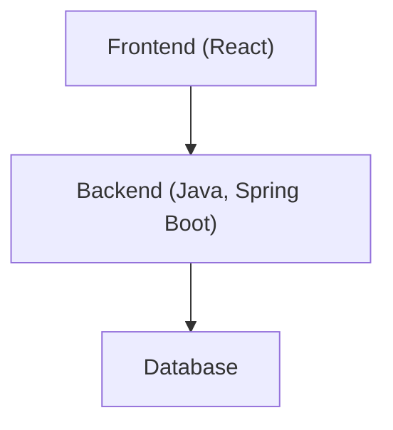
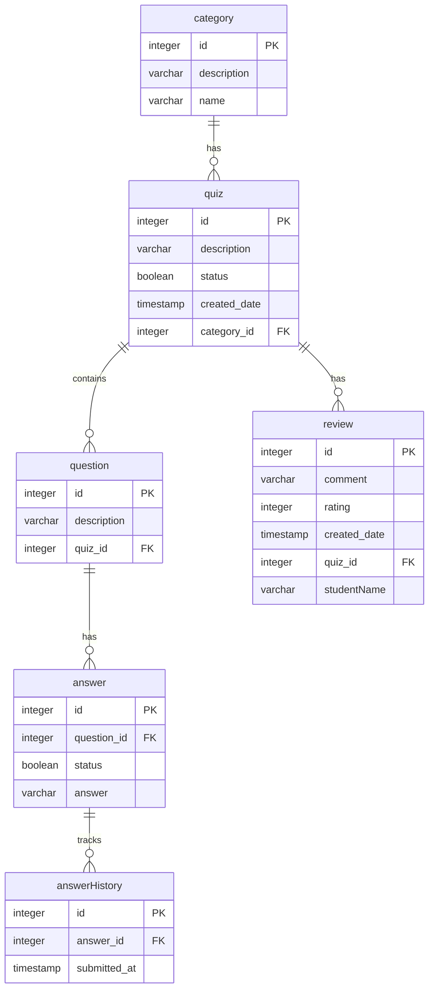

# Quizzer

## Project Description

Quizzer is a web-based platform designed for teachers and students at Haaga Helia to enhance learning through interactive quizzes. Teachers can create, manage, and categorize quizzes with multiple-choice questions on course-related topics, while students can take these quizzes to test and improve their knowledge. The application includes two main dashboards: a Teacher Dashboard, where teachers add and organize quizzes by categories like "Vocabulary" or "Geography" and manage questions and answers, and a Student Dashboard, where students can access published quizzes, receive instant feedback on their answers, view results, and share their thoughts through reviews. Quizzer aims to make learning engaging and accessible for both teachers and students.

## Team Members

- Shiyang Chen, [GitHub Profile](https://github.com/ChenFangFangFang)
- Emad Yazdankhah, [Github Profile](https://github.com/emaDBytes)
- Leon Mbishibishi, [Github Profile](https://github.com/mbishibishi11)
- Yen (Chloe) Nguyen, [Github Profile](https://github.com/chloee122)
- Temitope Ajayi, [Github Profile](https://github.com/Topebhh500)
- Hardik Savsani, [Github Profile](https://github.com/hardiksavsani)

## Backlog

Here is the link to the [Backlog](https://github.com/orgs/unicornteam2024/projects/1/views/1)

## Deployment URL

- Here is the link to the backend [Quizzer - Teacher Dashboard](https://quizzer-c8si.onrender.com/)
- Here is the link to the frontend [Quizzer - Student Dashboard](https://quizzer-dumz.onrender.com/)
- Here is the Swagger Rest API Link [Quizzer - Swagger API Link](https://quizzer-c8si.onrender.com/swagger-ui/index.html#/)

## Developer Guide

This guide provides instructions for setting up and running the application. It covers both backend and frontend parts, as well as the project's architecture.

### Project Architecture

The project architecture consists of three main components:

- **Database**: Stores data persistently. Different database platforms may be used in development and production environments.
- **Backend**: Handles the business logic, data processing, and API endpoints. It connects the frontend and database.
- **Frontend**: The user interface (UI) written in React, where users interact with the application.

#### Architecture Diagram

### Backend

#### Prerequistites

- **Java Version**: The application requires **Java 17** to ensure accurate use. Please make sure you have the correct version installed on your machine.

#### Getting Started

1. **Clone the Repository**  
   Clone the project to your local machine using Git:  
   git clone https://github.com/unicornteam2024/quizzer.git

2. **Navigate to the project Directory**  
   `cd quizzer`
3. **Build Application**  
   Compile and build the application using the following command:  
   `./mvnw clean install`

   Note: The command `./mvnw` uses the Maven Wrapper provided in the repository, which ensures consistency with the Maven version used in the project. On Windows, use `mvnw.cmd` instead of `./mvnw`.

4. **Run Application**  
   `./mvnw spring-boot:run`
5. **Verify Application Status**  
   Once started, the application will be accessible at http://localhost:8080 by default (or another port if specified in the configuration).
6. **Troubleshooting**  
   Ensure you are running the correct Java version. You can verify your Java version with:  
   `java version`  
   If you encounter issues with permissions for `./mvnw`, make it executable by running:  
    `chmod +x mvnw`

### Frontend

#### Prerequisites

- **Node.js**: Install the latest stable version of Node.js, which includes npm.

#### Setting Up the Frontend

1. **Navigate to the Frontend Directory**

   The frontend code is located in the `student-dashboard` folder within the project.

   `cd student-dashboard`

2. **Install Dependencies**

   Install the required npm packages:

   `npm install`

3. **Start the Frontend Application**

   Run the following command to start the frontend server:

   `npm run dev`

   The application will be accessible by default at http://localhost:5173.

#### Technology Stack

- **Programming Language**: JavaScript

- **Framework**: React

- **Major Libraries**:

  React Router for routing

  Axios for API requests

  Other libraries as required by the project setup

### Database Platforms

- **Development Environment**: Uses an in-memory H2 database for quick setup.
- **Production Environment**: Uses a PostgreSQL database for reliable data persistence.

### Data model

